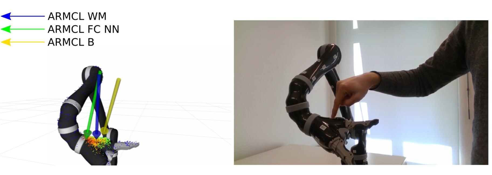

# MuSe ARMCL: ARM Contact point Localization via Monte Carlo Localization

## Demonstartion 

A video demonstration can be found on [youtube](https://youtu.be/2131Hu-yEuE) 

## Dependencies & Installation
To install muse_armcl the following dependencies are required. We suggest using ROS kinetic.

* ROS dependencies:

	sudo apt-get install ros-distro-orocos-kdl
	sudo apt-get install ros-distro-trac-ik
	
* External dependencies:
	- Download and install [OpenMesh](https://www.openmesh.org/download/	) OpenMesh 

* Internal dependencies:
Create a workspace and clone the following repositories:

		git clone https://github.com/cogsys-tuebingen/muse_smc.git
		git clone https://github.com/cogsys-tuebingen/cslibs_plugins.git
		git clone https://github.com/cogsys-tuebingen/cslibs_mesh_map.git
		git clone  https://github.com/cogsys-tuebingen/cslibs_indexed_storage.git
		git clone https://github.com/cogsys-tuebingen/cslibs_kdl.git
		git clone https://github.com/cogsys-tuebingen/cslibs_utility.git
		git clone https://github.com/cogsys-tuebingen/cslibs_math.git
		
Compile with 
 
 	catkin_make -DCMAKE_BUILD_TYPE=Release 
 	
 or
 
 	 catkin_make -DCMAKE_BUILD_TYPE=RelWithDebInfo	

## Robot Model

You can provide your robot model as an ROS URDF model. 
Currently, serial manipulators with up to 3 fingers are supported. To support other kinematic trees you have to modify/update the [**ExternalForcesSerialChain**](https://github.com/cogsys-tuebingen/cslibs_kdl/blob/master/cslibs_kdl/include/cslibs_kdl/external_forces.h) class in [**cslibs_kdl**](https://github.com/cogsys-tuebingen/cslibs_kdl). 
Besides, you require a mesh surface model of your manipulator in the obj-format.
For surface model examples for the Kinova Jaco 2 see [here](https://github.com/cogsys-tuebingen/jaco2_contact_detection/tree/github).

## Measurements

For measurements the particle filter requires a **sensor_msgs/JointState**.
In this Joint State we have to **provide the current joint angles** and the **effort** field has to be set with the current **external torque estimates**.  To estimate external torques you can use your own method or the observer provided in  [**cslibs_kdl**](https://github.com/cogsys-tuebingen/cslibs_kdl/blob/master/cslibs_kdl/launch/external_torque_observer.launch). if you have torque sensor in your manipulator.

## Confusion Matrix Plot Script

	rosrun muse_armcl plot_conf_mat.py -i <input file> -o <output file (optional)>

## Citation
* MuSe ARMCL:

		@inproceedings{O:Zwiener:2019,
		        title={{ARMCL\ - ARM Contact point Localization via Monte Carlo Localization}},
		        author={Zwiener, Adrian and Hanten, Richard and Schulz, Cornelia and Zell, Andreas},
		        month={October},
		        year={2019},
		        booktitle={2019 IEEE/RSJ International Conference on Intelligent Robots and Systems (IROS)},
		        note={(under review)}
		}

* MuSe Framework
	
		@INPROCEEDINGS{Hanten:2019,
		        author={Hanten, Richard and Schulz, Cornelia and Zwiener, Adrian and Zell, Andreas},
		        title={Multi-Sensor Integration for Sequential Monte Carlo Methods},
		        booktitle={2019 IEEE/RSJ International Conference on Intelligent Robots and Systems (IROS)},
		        month={October},
		        year={2019},
		        note={(under review)},
		}
	
